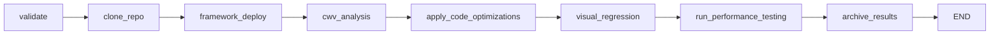

# CWV Optimizer Pipeline - Detailed Step-by-Step Analysis

This document provides a granular breakdown of exactly what happens at each step of the `cwv_optimizer` framework pipeline.

---

## Pipeline Overview



---

## Step 1: Validate Framework Pipeline

**File:** `nodes/validation.py` → `validate_framework_pipeline_node()`

### What Happens:
1. **Extract config from state:**
   - `github_url` - required
   - `framework` - required (Hexo, Jekyll, or Static HTML)
   - `device` - optional (desktop/mobile)

2. **Validate GitHub URL:**
   ```python
   pattern = r"^https?://github\.com/[\w\-\.]+/[\w\-\.]+/?$"
   re.match(pattern, url)
   ```
   - Checks URL matches `https://github.com/{owner}/{repo}` format

3. **Validate framework:**
   - Must be one of: `{"Hexo", "Jekyll", "Static HTML"}`
   - Raises `ValueError` if invalid

4. **Output:** Original state passed through (no modifications)

---

## Step 2: Clone Repository

**File:** `nodes/clone_repo.py` → `clone_repo_node()`

### What Happens:

#### 2.1 Extract Repository Name
```python
repo_name = github_url.rstrip("/").split("/")[-1].replace(".git", "")
# Example: https://github.com/owner/my-repo → "my-repo"
```

#### 2.2 Create Directory Structure
```
dumps/{repo_name}_{YYYYMMDD_HHMMSS}/
├── codebase/           # Will contain cloned repo
├── logs/
│   ├── run.log         # Main execution log
│   └── branches/       # Per-suggestion aider logs
├── results/            # Test outputs
└── screenshots/        # Visual regression images
```

#### 2.3 Set Up File Logger
- Creates logger at `logs/run.log`
- All subsequent operations log to this file
- Format: `2025-12-29 02:15:00 | INFO | cwv_run.my-repo | message`

#### 2.4 Clone Repository
```bash
git clone https://github.com/owner/my-repo /path/to/dumps/my-repo_20251229_021500/codebase
```
- Captures stdout/stderr to log
- Optionally checks out specific revision if `revision_id` provided

#### 2.5 Update State
```python
state["workspace_dir"] = "/path/to/codebase"
state["run_dir"] = "/path/to/dumps/my-repo_20251229_021500"
state["logs_dir"] = "/path/to/logs"
state["branch_logs_dir"] = "/path/to/logs/branches" 
state["results_dir"] = "/path/to/results"
state["screenshots_dir"] = "/path/to/screenshots"
state["log_file"] = "/path/to/logs/run.log"
state["repo_name"] = "my-repo"
```

---

## Step 3: Framework Deploy

**File:** `nodes/framework_deploy_node.py` → `framework_deploy_node()`

### What Happens:

#### 3.1 Find Available Port
```python
port = find_available_port(8000)  # Tries 8000, 8001, 8002... until free
```

#### 3.2 Determine Commands Based on Framework
| Framework | Check File | Commands |
|-----------|------------|----------|
| **Hexo** | `package.json` | `npm install` → `npx hexo server -p {port}` |
| **Hexo** (built) | `index.html` | `python -m http.server {port}` |
| **Jekyll** | `Gemfile` | `bundle install` → `bundle exec jekyll serve --port {port}` |
| **Jekyll** (no Bundler) | `_config.yml` | `jekyll serve --port {port}` |
| **Static HTML** | `index.html` | `python -m http.server {port}` |

#### 3.3 Run Install Commands (if any)
```python
# For each install command (all except last):
subprocess.run(command, cwd=repo_path, timeout=120)
```
- Timeout: 2 minutes per install command
- Logs: stdout/stderr captured to run.log

#### 3.4 Start Server in Background
```python
process = subprocess.Popen(
    serve_command,
    cwd=repo_path,
    stdout=log_file,
    stderr=subprocess.STDOUT,
    preexec_fn=os.setsid,  # Own process group for cleanup
)
```
- Output goes to `server.log`

#### 3.5 Health Check Loop
```python
for elapsed in range(0, 30, 2):  # Check every 2 seconds
    if check_server_health(port, timeout=3):
        return success
    if process.poll() is not None:
        return error  # Process died
```
- Makes HTTP GET to `http://localhost:{port}`
- Expects HTTP 200 response

#### 3.6 Update State
```python
state["deployed_url"] = "http://127.0.0.1:8080"
state["server_pid"] = 12345
state["url"] = "http://127.0.0.1:8080"
```

---

## Step 4: CWV Analysis

**File:** `nodes/cwv_analysis.py` → `cwv_analysis_node()`

### What Happens:

#### 4.1 Run CWV Agent
```bash
cd cwv-agent/
node index.js --action prompt --url http://127.0.0.1:8080 --model gpt-5 --device mobile
```
- Timeout: 10 minutes
- Uses `cwv_model` from state (default: `gpt-5`)

#### 4.2 CWV Agent Internal Steps
1. **Load URL in headless browser**
2. **Capture HAR file** (HTTP Archive)
3. **Get CrUX data** (Chrome User Experience Report)
4. **Run PageSpeed Insights**
5. **Inject Performance Observer** (LCP, CLS, INP)
6. **Analyze HTML/CSS/JS**
7. **Generate suggestions** via LLM

#### 4.3 Parse Output
```python
# Look for:
# "✅ Structured suggestions saved at: /path/to/suggestions.json"
suggestions_match = re.search(
    r"✅ Structured suggestions saved at:\s*(.+\.json)", stdout
)
```

#### 4.4 Output Files
- `cwv-agent/.cache/{url}.{device}.suggestions.{model}.json`
- `cwv-agent/.cache/{url}.{device}.report.{model}.md`

#### 4.5 Update State
```python
state["parsed_suggestions_path"] = "/path/to/suggestions.json"
state["cwv_report_path"] = "/path/to/report.md"
```

---

## Step 5: Apply Code Optimizations

**File:** `nodes/code_optimization.py` → `apply_code_optimizations_node()`  
**Service:** `services/code_optimizer.py` → `apply_code_optimizations()`

### What Happens:

#### 5.1 Load Suggestions
```python
with open(suggestions_path) as f:
    suggestions = json.load(f)["suggestions"]
# Example: 6 suggestions loaded
```

#### 5.2 For Each Suggestion (×N runs)
```python
for idx, suggestion in enumerate(suggestions, 1):
    for run_num in range(1, apply_count + 1):
        branch_name = f"suggestion_{idx}_run{run_num}_{uuid[:8]}"
        # e.g., "suggestion_1_run1_abc12345"
```

#### 5.3 Create Git Branch
```bash
git checkout main
git checkout -b suggestion_1_run1_abc12345
```

#### 5.4 Run Aider AI
```bash
aider index.html styles.css scripts.js \
    --read styles.css --read lazy-styles.css \
    --model azure/gpt-5 \
    --architect \
    --editor-model azure/gpt-4.1 \
    --message-file /tmp/prompt.md \
    --no-auto-commits \
    --llm-history-file /path/to/logs/branches/suggestion_1_run1_abc12345.txt \
    --yes
```

**Prompt Example:**
```markdown
Apply the following performance optimization:

Title: Inline critical CSS and defer the full stylesheet

Description: The main stylesheet blocks rendering for 800ms...

Implementation: Extract critical above-the-fold CSS into <style> tags...

Make the necessary changes to improve performance.
```

#### 5.5 Commit Changes
```bash
git add -A
git commit -m "Apply performance suggestion"
git checkout main
```

#### 5.6 Save Results
**File:** `results/application_results.json`
```json
{
  "timestamp": "2025-12-29T02:20:00",
  "suggestions_path": "/path/to/suggestions.json",
  "agent": "aider",
  "model": "azure/gpt-5",
  "results": [
    {
      "suggestion_index": 1,
      "run": 1,
      "branch": "suggestion_1_run1_abc12345",
      "status": "success",
      "suggestion": {
        "id": 1,
        "title": "Inline critical CSS",
        "description": "...",
        "metric": "LCP",
        "priority": "High",
        "implementation": "..."
      }
    }
  ]
}
```

#### 5.7 Update State
```python
state["suggestion_results_path"] = "/path/to/results/application_results.json"
```

---

## Step 6: Visual Regression Testing

**File:** `nodes/visual_regression.py` → `visual_regression_node()`  
**Service:** `services/visual_regression.py` → `run_visual_regression_tests()`

### What Happens:

#### 6.1 Get List of Branches
```bash
git branch | grep "suggestion_"
# suggestion_1_run1_abc12345
# suggestion_2_run1_def67890
# ...
```

#### 6.2 Capture Baseline Screenshot
```python
git checkout main
# Start server on baseline
screenshot = page.screenshot(full_page=True)
# Save to: screenshots/baseline_main.png
```

#### 6.3 For Each Suggestion Branch:

##### 6.3.1 Checkout Branch & Restart Server
```bash
git checkout suggestion_1_run1_abc12345
# Kill old server, start new one
```

##### 6.3.2 Capture Branch Screenshot
```python
screenshot = page.screenshot(full_page=True)
# Save to: screenshots/suggestion_1_run1_abc12345.png
```

##### 6.3.3 Compare with GPT-4 Vision
```python
# Encode both images as base64
client = AzureOpenAI(...)
response = client.chat.completions.create(
    model="gpt-4o",
    messages=[{
        "role": "user",
        "content": [
            {"type": "text", "text": "Compare these screenshots... respond TRUE or FALSE for regression"},
            {"type": "image_url", "image_url": {"url": f"data:image/png;base64,{baseline_b64}"}},
            {"type": "image_url", "image_url": {"url": f"data:image/png;base64,{branch_b64}"}},
        ]
    }],
    max_tokens=10,
)
# Returns: "FALSE" (no regression) or "TRUE" (regression detected)
```

#### 6.4 Save Results
**File:** `results/visual_regression.json`
```json
{
  "timestamp": "2025-12-29T02:25:00",
  "url": "http://127.0.0.1:8080",
  "device": "mobile",
  "baseline_screenshot": "screenshots/baseline_main.png",
  "results": [
    {
      "branch": "suggestion_1_run1_abc12345",
      "status": "success",
      "screenshot_path": "screenshots/suggestion_1_run1_abc12345.png",
      "has_regression": false,
      "gpt_response": "FALSE"
    }
  ]
}
```

#### 6.5 Update State
```python
state["visual_regression_results_path"] = "/path/to/results/visual_regression.json"
```

---

## Step 7: Performance Testing

**File:** `nodes/performance_testing.py` → `run_performance_testing_node()`  
**Service:** `services/performance_testing.py` → `run_cwv_tests()`

### What Happens:

#### 7.1 Load Application Results
```python
with open(application_results_path) as f:
    branches = [r["branch"] for r in json.load(f)["results"]]
```

#### 7.2 Filter Branches (Visual Regression Pass)
```python
# Only test branches that passed visual regression
valid_branches = [b for b in branches if not has_regression(b)]
```

#### 7.3 Measure Baseline (Main Branch)
```bash
git checkout main
# Restart server
```

```python
for run in range(num_runs):  # Default: 3 runs
    metrics = await measure_cwv_metrics(url, device="mobile")
    # Returns: {LCP: 4520.0, CLS: 0.0012, INP: 156.0, ...}
```

#### 7.4 For Each Suggestion Branch:
```bash
git checkout suggestion_1_run1_abc12345
# Restart server
```

```python
for run in range(num_runs):
    metrics = await measure_cwv_metrics(url, device="mobile")
```

#### 7.5 Aggregate Metrics
```python
# For each branch:
metrics = {
    "LCP_median": statistics.median(lcp_values),
    "LCP_mean": statistics.mean(lcp_values),
    "LCP_stdev": statistics.stdev(lcp_values),
    "LCP_p75": quantiles(lcp_values)[2],
    "LCP_rating": "Poor" if lcp_p75 > 4000 else "Needs Improvement" if lcp_p75 > 2500 else "Good",
    # Same for CLS, INP, FID, TTFB, FCP
}
```

#### 7.6 Save Results
**File:** `results/cwv_summary.json`
```json
{
  "timestamp": "2025-12-29T02:30:00",
  "url": "http://127.0.0.1:8080",
  "device": "mobile",
  "num_runs": 3,
  "framework": "Static HTML",
  "warmup_enabled": true,
  "baseline": {
    "branch": "main",
    "is_baseline": true,
    "runs": [
      {"LCP": 4520.0, "CLS": 0.0, "INP": 156.0, ...},
      {"LCP": 4480.0, "CLS": 0.0, "INP": 148.0, ...},
      {"LCP": 4510.0, "CLS": 0.0, "INP": 152.0, ...}
    ],
    "metrics": {
      "LCP_median": 4510.0,
      "LCP_mean": 4503.3333,
      "LCP_rating": "Poor",
      ...
    }
  },
  "results": [
    {
      "branch": "suggestion_1_run1_abc12345",
      "runs": [...],
      "metrics": {...}
    }
  ]
}
```

#### 7.7 Update State
```python
state["testing_results_dir"] = "/path/to/results"
```

---

## Step 8: Archive Results

**File:** `nodes/archival.py` → `archive_results_node()`

### What Happens:

#### 8.1 Check for S3 Configuration
```python
if not state.get("s3_bucket"):
    logger.info("S3 bucket not configured, skipping archival")
    return state  # No-op
```

#### 8.2 If S3 Configured:
```python
# Consolidate all results into archive
consolidate_and_archive_results(
    dump_dir=run_dir,
    s3_bucket="my-bucket",
    s3_prefix="cwv-results/",
)
```

#### 8.3 Upload Files
- `results/cwv_summary.json`
- `results/visual_regression.json`
- `results/application_results.json`
- `screenshots/*`

---

## Final Output Structure

```
dumps/my-repo_20251229_021500/
├── codebase/                          # Cloned repository with branches
│   └── (all repo files)
├── logs/
│   ├── run.log                        # Main execution log
│   └── branches/
│       ├── suggestion_1_run1_abc12345.txt
│       ├── suggestion_2_run1_def67890.txt
│       └── ...
├── screenshots/
│   ├── baseline_main.png
│   ├── suggestion_1_run1_abc12345.png
│   ├── suggestion_2_run1_def67890.png
│   └── ...
├── results/
│   ├── application_results.json       # What code changes were applied
│   ├── visual_regression.json         # Screenshot comparison results
│   └── cwv_summary.json               # Performance metrics by branch
└── server.log                         # Server process output
```

---

## Metric Collection Details

### JavaScript Injection (Performance Observer)
```javascript
window.__webVitals = { lcp: null, cls: 0, inp: null, ... };

// LCP Observer
new PerformanceObserver((list) => {
    const entry = list.getEntries().at(-1);
    window.__webVitals.lcp = entry.renderTime || entry.loadTime;
}).observe({ type: 'largest-contentful-paint', buffered: true });

// CLS Observer (session window approach)
new PerformanceObserver((list) => {
    for (const entry of list.getEntries()) {
        if (!entry.hadRecentInput) {
            // Accumulate layout shift values in session windows
            clsValue += entry.value;
        }
    }
}).observe({ type: 'layout-shift', buffered: true });

// INP Observer (interaction latency)
new PerformanceObserver((list) => {
    for (const entry of list.getEntries()) {
        if (entry.interactionId) {
            interactionMap.set(entry.interactionId, entry);
        }
    }
    // INP = P75 of all interactions
}).observe({ type: 'event', buffered: true, durationThreshold: 16 });
```

### Device Throttling (Mobile)
```python
DEVICE_CONFIGS["mobile"] = {
    "viewport": {"width": 412, "height": 915},
    "user_agent": "Chrome Mobile",
    "cpu_throttling": 20,  # 20x slowdown
    "network_conditions": {
        "latency": 150,  # 150ms
        "downloadThroughput": 131072,  # 1 Mbps
        "uploadThroughput": 49152,  # 384 Kbps
    }
}
```

---

## Error Handling

Each node follows this pattern:
```python
async def node(state):
    try:
        # ... do work ...
        if result["status"] != "success":
            state.setdefault("errors", []).append(error)
            raise RuntimeError(error)
        return state
    except Exception as e:
        # Logged and propagated up
        raise
```

Errors are collected in `state["errors"]` list for debugging.
